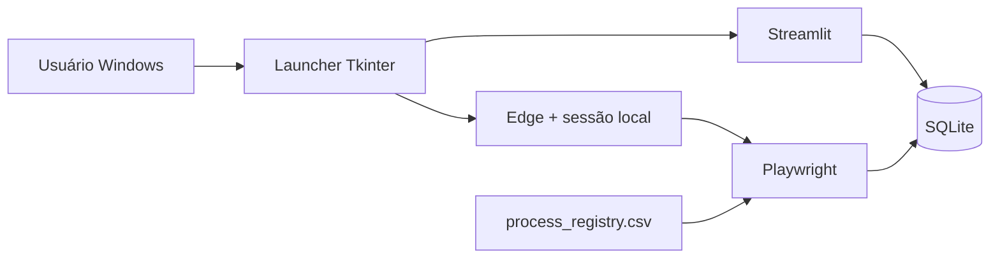
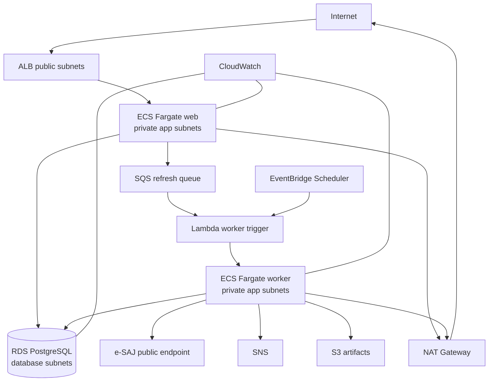

# Arquitetura do Painel Pericial Cloud

## 1. Estado inicial

O desenho era adequado para um protótipo single-user, porém o host carregava UI, sessão, banco, scheduler e coleta. Isso tornava disponibilidade, backup, concorrência e automação de deploy dependentes de uma máquina local.

## 2. Estado alvo

### Traffic boundaries

- **ALB** é o único componente de aplicação que recebe tráfego da internet.
- **Web e worker** não recebem IP público e executam em sub-redes privadas.
- **RDS** está em sub-redes de banco e aceita 5432 apenas dos security groups web/worker.
- Saída do worker para a fonte pública ocorre via NAT.

### Workload boundaries

**Web service**: leitura do dashboard, filtros e enqueue de pedidos de atualização. A task role só precisa de `sqs:SendMessage` para a fila de refresh.

**Worker task**: execução efêmera. Lê processos ativos do PostgreSQL, consulta a fonte pública, persiste novas movimentações e publica alertas relevantes. Não fica aguardando requisições.

**Trigger Lambda**: concentra a permissão `ecs:RunTask`/`iam:PassRole`, evitando entregar essa permissão diretamente ao dashboard.

## 3. Fluxo de atualização manual

1. usuário clica em **Solicitar atualização**;
2. web envia mensagem ao SQS;
3. event source mapping invoca Lambda;
4. Lambda inicia uma task Fargate worker;
5. worker consulta processos e persiste resultados;
6. novos alertas podem ser publicados no SNS;
7. logs e falhas ficam centralizados no CloudWatch.

Esse desenho desacopla latência do scraper da sessão web e absorve rajadas de cliques por meio da fila.

## 4. Fluxo agendado

EventBridge Scheduler invoca a mesma Lambda em `rate()`/`cron()`. A execução manual e a recorrente convergem no mesmo mecanismo de criação do worker, reduzindo caminhos operacionais diferentes.

## 5. Data plane

- PostgreSQL é system of record operacional.
- Secrets Manager gerencia a senha principal criada pelo RDS.
- S3 é reservado para artefatos temporários e possui bloqueio público, versionamento, criptografia server-side e lifecycle.
- Dados reais não fazem parte do repositório.

## 6. Deployment plane

GitHub Actions solicita token OIDC e assume uma IAM role temporária. O pipeline não armazena `AWS_ACCESS_KEY_ID`/`AWS_SECRET_ACCESS_KEY`. A trust policy aceita apenas este repositório nos GitHub Environments `aws-dev` e `aws-prod`; as protection rules do environment são o ponto de aprovação para produção.

O bootstrap e o workload são stacks Terraform separados porque ECR, backend remoto e trust OIDC precisam existir antes do primeiro deploy automatizado da aplicação.

## 7. Disponibilidade

### Dev / portfolio

- 1 task web;
- 1 NAT Gateway;
- RDS Single-AZ;
- WAF desabilitado por padrão;
- budget alert opcional.

### Production reference

- >=2 tasks web distribuídas entre AZs;
- NAT por AZ;
- RDS Multi-AZ;
- WAF habilitado;
- TLS com ACM;
- autenticação Cognito no listener HTTPS;
- deletion protection e processo de restore testado;
- revisão de RTO/RPO e retenção de backups.

## 8. Restrição deliberada

O legado possuía automação conectada a uma sessão Edge autenticada manualmente. Essa sessão **não é transportada para AWS**. A arquitetura cloud só automatiza a consulta pública. Qualquer evolução autenticada deve utilizar mecanismo autorizado e compatível com os controles da fonte.
